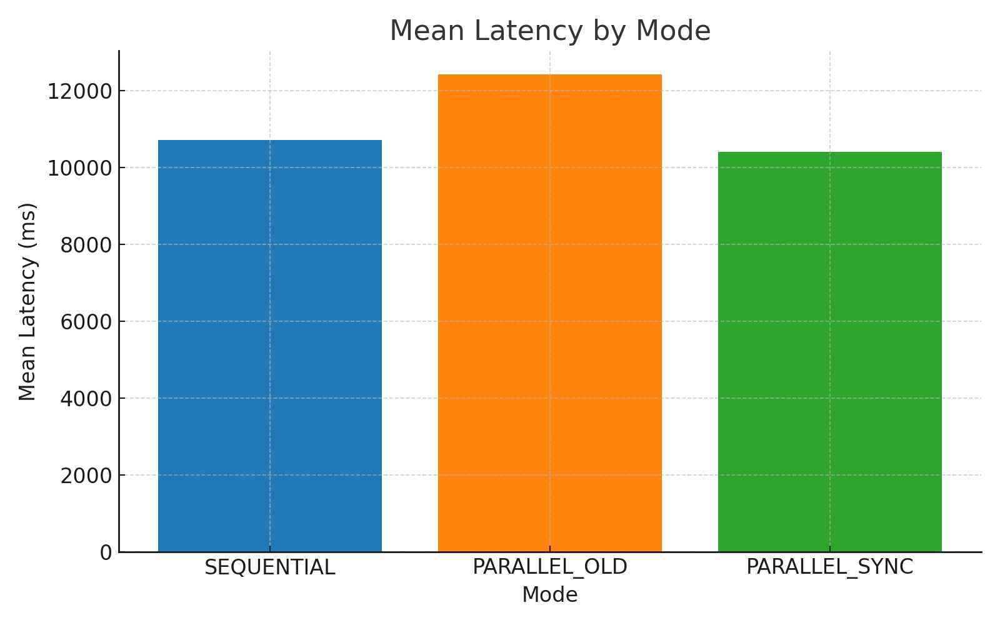
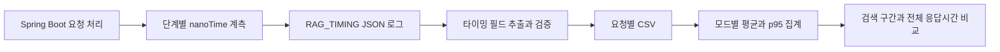

# 수면 상담 검색의 지연시간 분석

수면 상담 서비스가 느려지는 구간을 찾기 위해 **서버 로그를 구조화된 데이터로 변환하고, 순차·병렬 실행의 지연시간을 비교한 개인 확장 연구**입니다. 팀 RAG 백엔드를 계측 대상으로 사용했습니다.

| 항목 | 핵심 내용 |
|---|---|
| 해결한 문제 | 클라이언트의 실행 모드 라벨과 실제 서버 모드가 달라 성능을 잘못 해석할 수 있는 문제 |
| 개인 작업 범위 | 실행 모드·단계별 계측, PowerShell 로그 추출, Python 통계 분석 |
| 핵심 기술 | Java/Spring Boot, CompletableFuture, PowerShell, pandas; 별도 PySpark 분석 경로 |
| 데이터 | 과거 서버 타이밍 90건, 3개 모드 × 30건, 요청당 15개 JSON 필드 |
| 대표 결과 | 서버 전체 p95 16,725.1 → 13,230.6 ms, 약 20.9% 감소. 복구한 원자료 재집계로 확인 |

[구조와 코드](docs/architecture.md) · [데이터 출처](docs/dataset.md) · [측정과 한계](docs/performance.md) · [원본 보고서와 정정](docs/report-errata.md)



*2025년 보고서의 실제 결과 그림입니다. 아래 실행 명령은 과거 데이터를 재집계하며 서비스에 새 요청을 보내지 않습니다.*

## Problem / Solution

초기에는 요청 시작부터 답변 도착까지 걸린 시간만 비교했습니다. 하지만 클라이언트의 `ModeLabel`을 바꾸는 것만으로 서버 실행 모드가 바뀌지는 않습니다. 최종 실험은 서버가 기록한 실제 `mode`, `strategy`와 단계별 시간을 CSV로 수집해 비교했습니다.

이번 공개본에서는 당시 소스와 최종 원자료를 복구했습니다. 데이터가 유효한지 검사하고 보고서 수치를 다시 계산하는 도구는 **2026년 포트폴리오 정리 때 추가한 코드**입니다.

## Architecture / Data Flow



검색·생성 서비스 전체는 [수면 상담 챗봇](https://github.com/YIM551/rag-sleep-assistant)에서 설명합니다. 이 저장소는 **측정 데이터의 생성·변환·분석**에 집중합니다. [실험 버전의 계측 코드](legacy/java/service/RagQueryService.java)는 현재 서비스 코드와 다른 시점의 snapshot입니다.

## Implementation

- `legacy/sleepwell-backend/tools/extract_rag_timing.ps1`: 당시 JSON 로그를 CSV로 변환한 코드.
- `legacy/sleepwell-backend/analyze_rag_timing.py`: 당시 pandas 통계 집계 코드.
- `legacy/analyze_rag_logs_spark.py`: PySpark 집계와 pandas fallback 구현. 분산 클러스터 실행 실적은 확인되지 않았습니다.
- `scripts/reproduce_historical.py`: 복구한 로그의 필드·모드·시간·설정 일관성을 검사하고 과거 선형 보간 p95를 재현합니다.
- `scripts/analyze_timings.py`: 이후 실험용 요청 ID·워밍업·실패 상태를 포함한 별도 측정 계약 검사기. 과거 기록에 없는 필드는 채워 넣지 않습니다.

## Experiments / Results

2025년 최종 서버 로그를 2026년에 다시 집계한 결과입니다. 각 모드 30건이며 새 성능 실험이 아닙니다.

| 실제 서버 모드 | 전체 평균 ms | 전체 p95 ms | Retrieval 평균 ms | Dense 작업시간 평균 ms |
|---|---:|---:|---:|---:|
| SEQUENTIAL | 10,722.83 | 16,725.10 | 5,832.30 | 2,257.73 |
| PARALLEL_OLD | 12,425.83 | 22,273.60 | 5,851.93 | 2,302.13 |
| PARALLEL_SYNC | 10,402.77 | 13,230.60 | 4,999.80 | 1,527.13 |

개선 병렬 모드의 전체 평균은 약 3.0%, 전체 p95는 약 20.9%, Retrieval 구간 평균은 약 14.3% 감소했습니다. **Retrieval 구간은 LLM 생성과 별도로 계측**했고, 병렬 작업시간을 합산해 만들지 않았습니다. 오버헤드가 원인이라는 설명은 가설이며 CPU 프로파일링으로 입증하지 않았습니다.

## Demo

서비스 실행 없이 [원자료](data/recovered/timing-events.jsonl), [당시 콘솔 결과](assets/historical-console.png), [재집계 JSON](data/recovered/reproduced-summary.json)을 대조할 수 있습니다. [시연 안내](docs/demo.md)

## Getting Started

Python 3.10 이상, 표준 라이브러리만으로 실행합니다.

```bash
git clone https://github.com/YIM551/rag-retrieval-benchmark.git
cd rag-retrieval-benchmark
python scripts/reproduce_historical.py data/recovered/timing-events.jsonl --summary output/summary.json --csv output/timings.csv
python -m unittest discover -s tests -v
```

과거 pandas 분석을 직접 실행하려면 별도 환경에 pandas를 설치한 후 다음 명령을 사용합니다. 원 실험의 정확한 dependency lock은 미복구입니다.

```bash
python legacy/sleepwell-backend/analyze_rag_timing.py data/recovered/rag_timing_metrics.csv
```

## My Contribution

기존 팀 백엔드를 확장한 개인 과목 프로젝트입니다. 실행 모드, 계측, 벤치마크와 분석 작업을 제시하며 팀 서비스 전체 구현을 개인 기여로 주장하지 않습니다. [코드 복구 출처와 변경 내역](docs/provenance.md)에서 과거 구현과 이번 공개 정리 작업을 구분합니다.

## Technical Challenges

실행 모드 라벨의 신뢰성, 서버 전체 시간과 검색 구간의 구분, 평균과 긴 대기시간의 차이가 핵심 과제였습니다. 복구 과정에서는 모드 덮어쓰기 옵션과 병렬 단계 중복 합산 문제도 발견해 새 검사기에서 차단하거나 해석 한계로 남겼습니다.

## Limitations / Future Work

- 90건 모두 스레드풀 설정 1, FINE, nested=true입니다. 동시 사용자 25명이나 대규모 트래픽 실험의 근거가 아닙니다.
- 타이밍 로그에 성공·실패, 요청 ID, 워밍업, 캐시 상태, 색인 snapshot 정보가 없어 오류율·TPS와 조건 통제를 복구하지 못했습니다.
- 같은 질의 집합에 대한 검색 품질·답변 품질 및 반복 실행의 신뢰구간은 별도 검증이 필요합니다.
- 향후에는 요청 ID·실패·워밍업·색인/설정 해시를 기록한 동일 조건 실험으로 재검증합니다. 외부 API 비용이 발생하는 실험은 이번 작업에서 실행하지 않았습니다.

## Project Structure / References

`legacy/`: 복구한 구현 · `data/recovered/`: 과거 타이밍 · `assets/`: 당시 그림 · `scripts/`: 현재 검증 도구 · `tests/`: 오프라인 검사 · `docs/`: 구조·출처·성능·재현성.

원자료는 「수면 상담 RAG 시스템의 병렬 Retrieval 성능 분석」(2025-12-10)과 당시 로컬 Git/실험 로그입니다. [개인정보를 제거한 보고서](docs/historical-report-anonymized.pdf)는 [정정 문서](docs/report-errata.md)와 함께 읽어 주세요.
