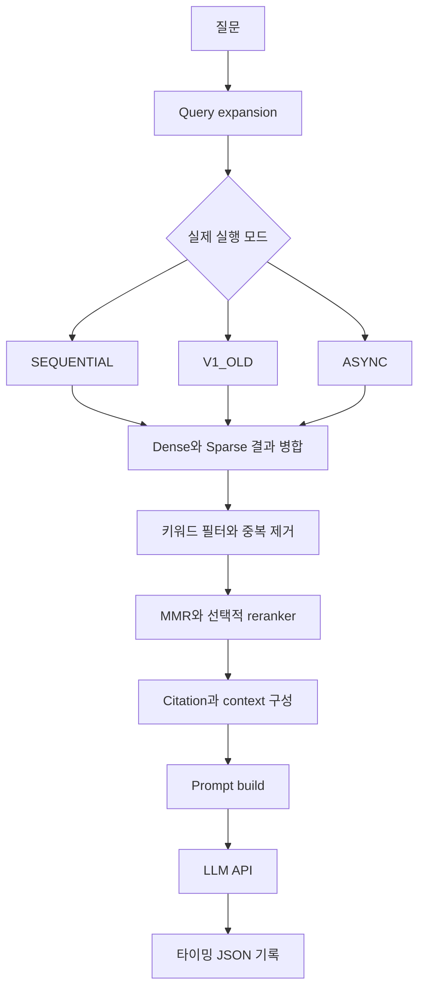

# 구조와 실제 코드

## 계측 대상

실험 source snapshot은 `sleepBE`의 `origin/feat/rag-parallel-retrieval-v3`, commit `317a9289df3556916bc2fa88ed8d7d200ef31b4c`입니다. 현재 서비스 배포본을 의미하지 않습니다.

`RagQueryService.runPipeline`은 query expansion, `retrieveWithFilters`의 wall-clock span, prompt build, LLM 호출을 별도로 잽니다. 검색 구간에는 병합·필터·MMR·선택적 rerank·citation 구성이 들어갑니다. 실제 prompt build는 그 바깥의 `contextMs`입니다.

## 코드 지도

| 관심 내용 | 파일/메서드 |
|---|---|
| 실행 모드 바인딩 | [RagProperties](../legacy/java/config/RagProperties.java), [RagExecutionMode](../legacy/java/model/RagExecutionMode.java) |
| 실행 분기·검색·계측 | [RagQueryService](../legacy/java/service/RagQueryService.java): runPipeline, runRetrievalWithStrategy, retrieveSequentialStrategy, retrieveAsyncStrategy |
| 필드 | [RagTimingRecord](../legacy/java/model/RagTimingRecord.java) |
| 당시 로그 추출 | [extract_rag_timing.ps1](../legacy/sleepwell-backend/tools/extract_rag_timing.ps1) |
| 당시 집계 | [analyze_rag_timing.py](../legacy/sleepwell-backend/analyze_rag_timing.py) |
| 현재 오프라인 재현 | [reproduce_historical.py](../scripts/reproduce_historical.py) |

`legacy/java`는 계측 관련 source 발췌이며 독립 빌드 프로젝트가 아닙니다. 서비스 전체를 확인하려면 [RAG 저장소](https://github.com/YIM551/rag-sleep-assistant)의 현재 서비스와 실험 시점 차이를 함께 확인하세요.
